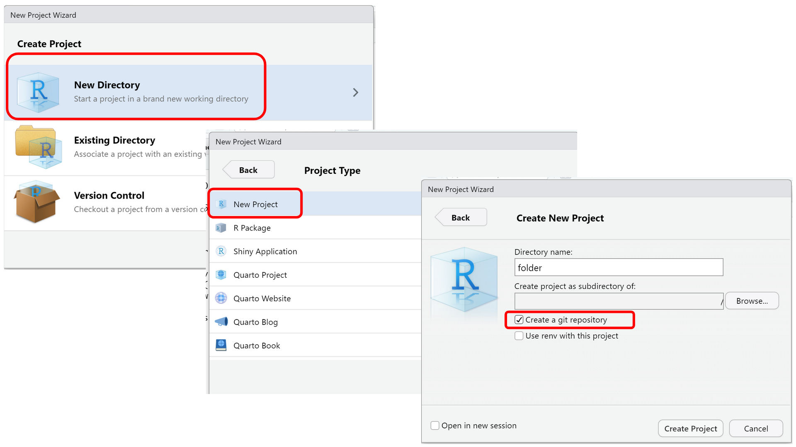
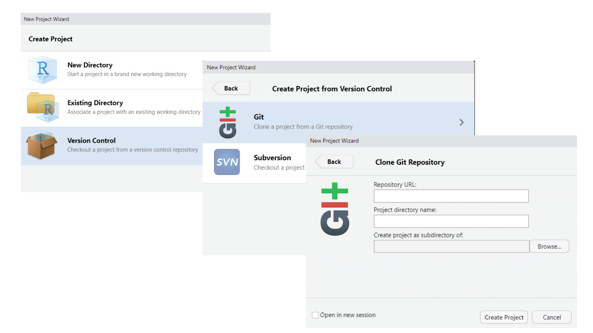
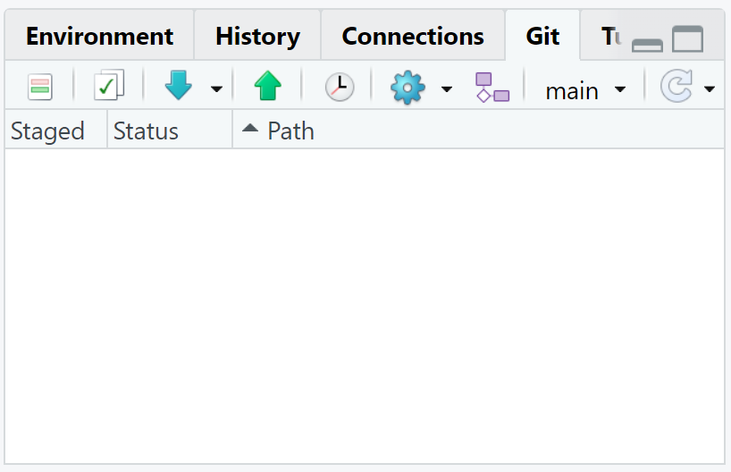
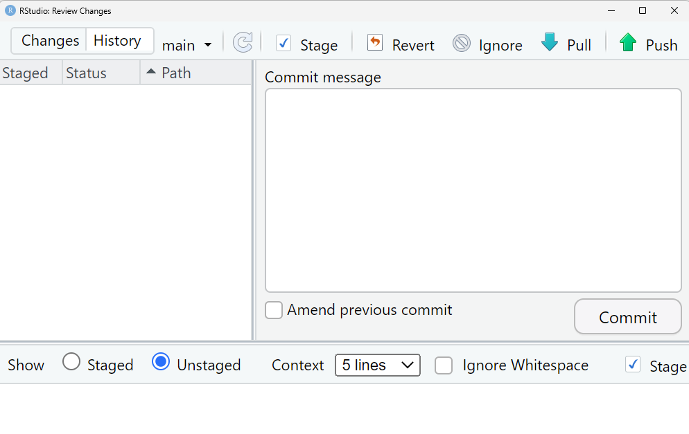
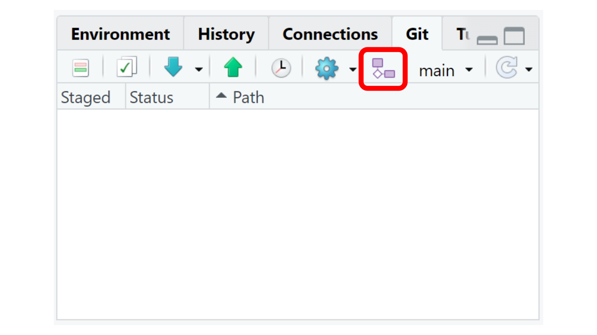
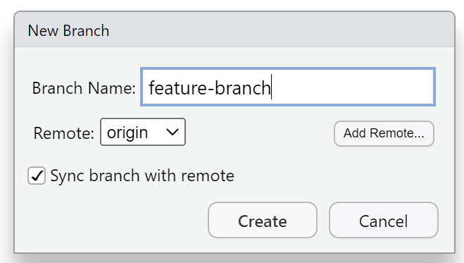
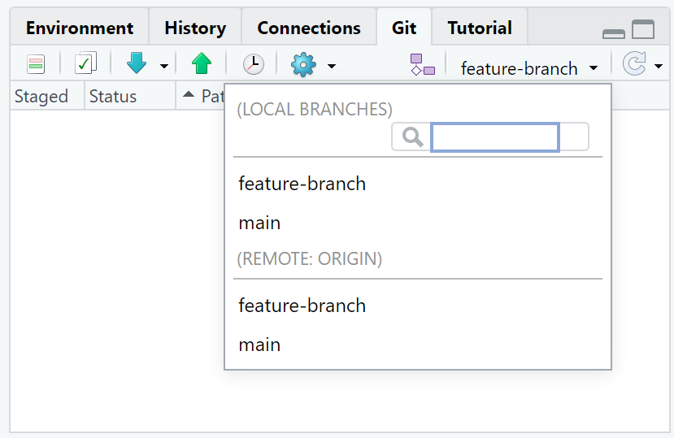

::::::::::::::::::::::::::::::::::::::: objectives

- Understand how to use Git from RStudio.

::::::::::::::::::::::::::::::::::::::::::::::::::

:::::::::::::::::::::::::::::::::::::::: questions

- How can I use Git with RStudio?

::::::::::::::::::::::::::::::::::::::::::::::::::

Version control can be very useful when developing data analysis scripts. For
that reason, the popular development environment
[RStudio][rstudio] for the R programming language has built-in
integration with Git. While some advanced Git features still require the
command-line, RStudio has a nice interface for many common Git operations.

::::::::::::::::: testimonial

We also invite you to read this blog post about [10 Commands to Get Started with Git](https://rviews.rstudio.com/2020/04/23/10-commands-to-get-started-with-git/) with screenshots of the Rstudio web-based interface.

:::::::::::::::::::::::::::::

## Create project

RStudio allows us to create a [project][rstudio-projects] associated with a
given directory to keep track of various related files. To be able to track the
development of the project over time, to be able to revert to previous
versions, and to collaborate with others, we version control the Rstudio
project with Git. To get started using Git in RStudio, we create a new project:

{alt='RStudio screenshot showing the file menu dropdown with "New Project..." selected'}

This opens a dialog asking us how we want to create the project. We have
some options here. Let's say that we want to use RStudio with the planets
repository that we already made. Since that repository lives in a directory on
our computer, we choose the option "Existing Directory":

{alt='RStudio screenshot showing New Project dialog window with "Create project from existing directory" selected'}

For a new directory, [follow the steps in this section about "Versioning new work"](https://nceas.github.io/oss-lessons/version-control/4-getting-started-with-git-in-RStudio.html#versioning_new_work).



To clone a remote repository from Rstudio, follow these steps:



:::::::::::::::::::::::::::::::::::::::::  callout

## Do You See a "Version Control" Option?

Although we're not going to use it here, there should be a "version control"
option on this menu. That is what you would click on if you wanted to
create a project on your computer by cloning a repository from GitHub.
If that option is not present, it probably means that RStudio doesn't know
where your Git executable is, and you won't be able to progress further
in this lesson until you tell RStudio where it is.

### Find your Git Executable

First let's make sure that Git is installed on your computer.
Open your shell on Mac or Linux, or on Windows open the command prompt
and then type:

- `which git` (macOS, Linux)
- `where git` (Windows)

If there is no version of Git on your computer, please follow the
[Git installation instructions](https://swcarpentry.github.io/git-novice/#installing-git)
in the setup of this lesson to install Git now. Next open your shell or command prompt
and type `which git` (macOS, Linux), or `where git` (Windows).
Copy the path to the git executable.

On one Windows computer which had GitHub Desktop installed on it, the path was:
`C:/Users/UserName/AppData/Local/GitHubDesktop/app-1.1.1/resources/app/git/cmd/git.exe`

NOTE: The path on your computer will be somewhat different.

### Tell RStudio where to find GitHub

In RStudio, go to the `Tools` menu > `Global Options` > `Git/SVN` and then
browse to the Git executable you found in the command prompt or shell. Now restart
RStudio.
Note: Even if you have Git installed, you may need
to accept the Xcode license if you are using macOS.


::::::::::::::::::::::::::::::::::::::::::::::::::

Next, RStudio will ask which existing directory we want to use. Click
"Browse..." and navigate to the correct directory, then click "Create Project":


<!--## git init-->

Ta-da! We have created a new project in RStudio within the existing planets
repository. Notice the vertical "Git" menu in the menu bar. RStudio has
recognized that the current directory is a Git repository, and gives us a
number of tools to use Git:

{alt='RStudio window after new project is created with large arrow pointing to vertical Git menu bar.'}

To edit the existing files in the repository, we can click on them in the
"Files" panel on the lower right. Now let's add some additional information
about Pluto:


<!--## git commit-->

Once we have saved our edited files, we can use RStudio to commit the changes
by clicking on "Commit..." in the Git menu:

{alt='RStudio screenshot showing the Git menu dropdown with "Commit..." selected'}

You can also use the buttons from the Git tab, usually in the upper right pane:



<!--## git diff-->

This will open a dialogue where we can select which files to commit (by
checking the appropriate boxes in the "Staged" column), and enter a commit
message (in the upper right panel). The icons in the "Status" column indicate
the current status of each file. Clicking on a file shows information about
changes in the lower panel (using output of `git diff`). Once everything is the
way we want it, we click "Commit":


<!--## git push-->

The changes can be pushed by selecting "Push Branch" from the Git menu. There
are also options to pull from the remote repository, and to view the commit
history:

{alt='RStudio screenshot showing the git menu dropdown with "History" selected'}

:::::::::::::::::::::::::::::::::::::::::  callout

## Are the Push/Pull Commands Grayed Out?

Grayed out Push/Pull commands generally mean that RStudio doesn't know the
location of your remote repository (e.g. on GitHub). To fix this, open a
terminal to the repository and enter the command: `git push -u origin main`. Then restart RStudio.


::::::::::::::::::::::::::::::::::::::::::::::::::

<!--## git log-->

If we click on "History", we can see a graphical version of what `git log`
would tell us:


<!--## .gitignore-->

RStudio creates a number of files that it uses to keep track of a project. We
often don't want to track these, in which case we add them to our `.gitignore`
file:

{alt='RStudio screenshot showing .gitignore open in the editor pane with the files .Rproj.user, .Rhistory, .RData, and \*.Rproj added to the end'}

:::::::::::::::::::::::::::::::::::::::::  callout

## Tip: versioning disposable output

Generally you do not want to version control disposable output (or read-only
data). You should modify the `.gitignore` file to tell Git to ignore these
files and directories.


::::::::::::::::::::::::::::::::::::::::::::::::::


In the `Rstudio: Review changes` window, you can also open the `.gitignore` files from the `Ignore` button. You can use the `Revert` button to do a `git checkout HEAD`, i.e., to undo changes not yet on staging area by restoring the local repository (last commit).



## Create a branch

In the Git tab, in the right hand side you will find the name of your current branch (e.g., `main`). Use the button in its left hand side to create a branch.



You can call it `feature-branch`:



You are able to switch between different branches using the menu displayed when you click in the branch name:



Git is a Version control software optimized for plain-text files. This can register non-linear changes.

::::::::::::::::: checklist

### Checklist

Key characteristics of Version control systems are:

1. Keep the entire history of a file and inspect a file throughout its lifetime.

2. Tag a particular version so you can return to them easily.

3. Facilitates collaborations and makes contributions transparent.

4. Experiment with code and feature without breaking the main project

:::::::::::::::::::::::::::


The best way to merge branches is on GitHub. We recommend you to read about how to [create a Pull Request](https://docs.github.com/en/pull-requests/collaborating-with-pull-requests/proposing-changes-to-your-work-with-pull-requests/creating-a-pull-request), and how to [merge a Pull Request](https://docs.github.com/en/pull-requests/collaborating-with-pull-requests/incorporating-changes-from-a-pull-request/merging-a-pull-request)

:::::::::::::::::::::::::::::::::::::::  challenge

## Challenge

1. Create a new directory within your project called `tests`.
2. Modify the `.gitignore` so that the `tests` directory is not version controlled.

:::::::::::::::  solution

## Solution to Challenge

This can be done in Rstudio:

```r
usethis::use_directory("tests")
```

Then open up the `.gitignore` file from the right-hand panel of Rstudio and add
`tests/` to the list of files to ignore.


:::::::::::::::::::::::::

::::::::::::::::::::::::::::::::::::::::::::::::::

There are many more features in the RStudio Git menu, but these should be
enough to get you started!

[rstudio]: https://www.rstudio.com/
[rstudio-projects]: https://support.rstudio.com/hc/en-us/articles/200526207-Using-Projects

:::::::::::::::::::::::::::::::::::::::: keypoints

- Using RStudio's Git integration allows you to version control a project over time.
- Feature branches help you experiment with code without breaking the main project.

::::::::::::::::::::::::::::::::::::::::::::::::::


