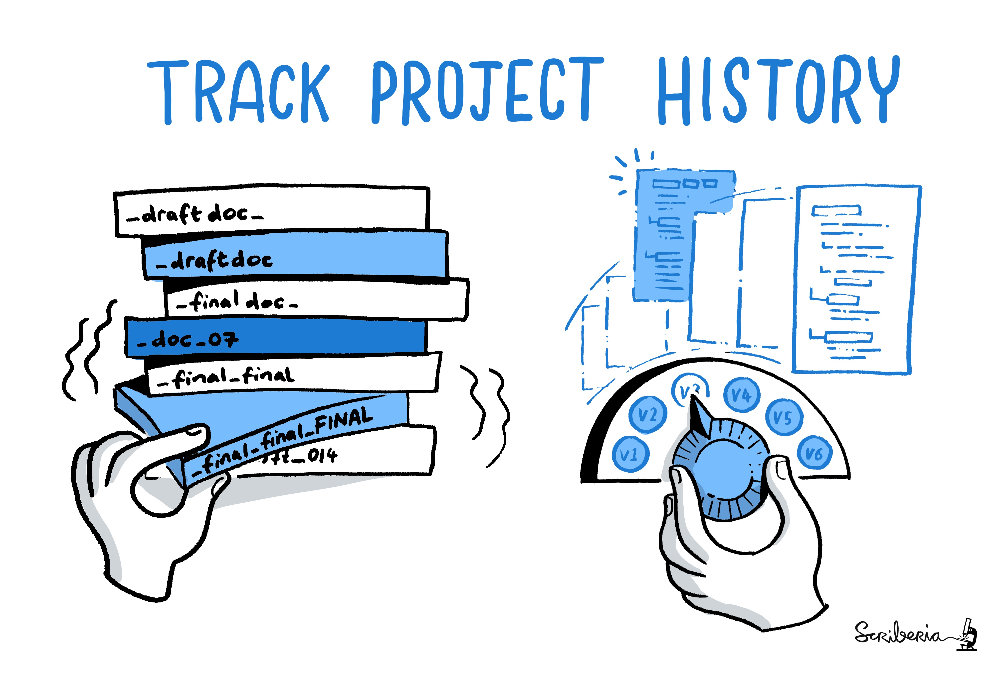
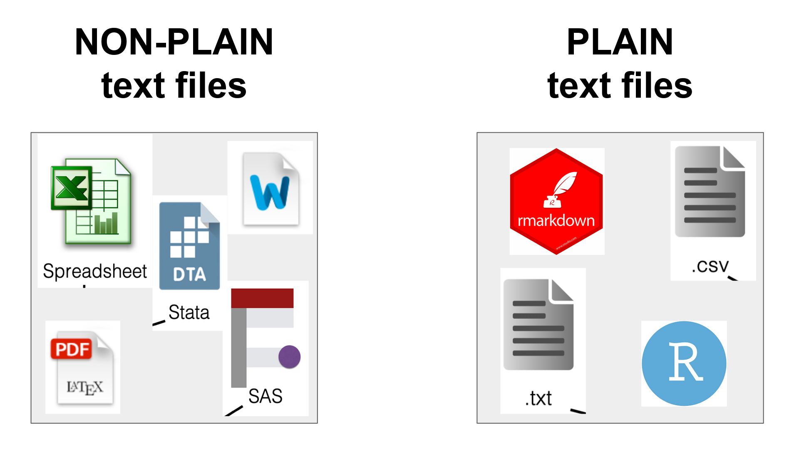
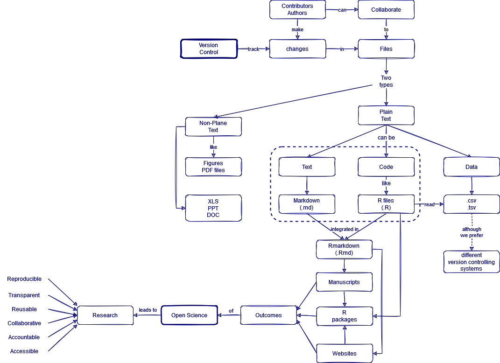

::::::::::::::::::::::::::::::::::::::: objectives

- Understand the benefits of an automated version control system.
- Understand the basics of how automated version control systems work.

::::::::::::::::::::::::::::::::::::::::::::::::::

:::::::::::::::::::::::::::::::::::::::: questions

- What is version control and why should I use it?

::::::::::::::::::::::::::::::::::::::::::::::::::

## Tracking changes

We'll start by exploring how we are usually introduced to version control to keep track of what one person did and when.
Even if you aren't collaborating with other people,
version control may have look like this situation:

{alt='One same files called manuscript with modification dates as prefix and what a person did as sufix.'}

We all started by replicating the Version control system of our initial community. We all need to differentiate files from previous versions or different colleagues (supervisors or reviewers). For those reasons, we tag each version to track what one person did (e.g., with a suffix) or when (e.g., with a prefix).

Does it seem unnecessary to you to have multiple nearly identical versions of the same document? Possibly yes. But this Version control system opens the possibility of returning to a specific version in case you erased something that you think now is essential.

::::::::::::::::: discussion

### File names to track changes

Write down:

- Is there any file naming convention that is familiar to you?

- What was the version control system that you first used?

- Share with us your favorite prefix or suffix!

:::::::::::::::::::::::::::::

::::::::::::::::::: instructor

We can use the comments or live participation as ice-breaker.

::::::::::::::::::::::::::::::

Some word
processors let us deal with this a little better, such as Microsoft
Word's
[Track Changes](https://support.office.com/en-us/article/Track-changes-in-Word-197ba630-0f5f-4a8e-9a77-3712475e806a),
Google Docs' [version history](https://support.google.com/docs/answer/190843?hl=en), or
LibreOffice's [Recording and Displaying Changes](https://help.libreoffice.org/Common/Recording_and_Displaying_Changes). Let's illustrate how Google Docs works.

To use Google Docs version history click `File` > `Version history` > `See version history`. This highlights the new content added to the file in that version only.

We can move to any previous version tagged with two metadata values: the modification date and the name of the author.

Google Docs’ version history tool is an automatic Version control system for single Word/Doc files that works online.

## Version control systems

Version control systems start with a base version of the document and
then record changes you make each step of the way. You can
think of it as a recording of your progress: you can rewind to start at the base
document and play back each change you made, eventually arriving at your
more recent version.

{alt='Changes Are Saved Sequentially'}

Once you think of changes as separate from the document itself, you
can then think about "playing back" different sets of changes on the base document, ultimately
resulting in different versions of that document.

A version control system is a tool that keeps track of these changes for us,
effectively creating different versions of our files. 

<!--
It allows us to decide
which changes will be made to the next version (each record of these changes is
called a [commit](../learners/reference.md#commit)), and keeps useful metadata
about them. The complete history of commits for a particular project and their
metadata make up a [repository](../learners/reference.md#repository).
Repositories can be kept in sync across different computers, facilitating
collaboration among different people.
-->

::::::::::::::::: checklist

### Checklist

Key characteristics of Version control systems are:

1. Keep the entire history of a file and inspect a file throughout its lifetime.

2. Tag a particular version so you can return to them easily.

:::::::::::::::::::::::::::

:::::::::::::::::::::::::::::::::::::::::  instructor

## The Long History of Version Control Systems

Automated version control systems are nothing new.
Tools like [RCS](https://en.wikipedia.org/wiki/Revision_Control_System), [CVS](https://en.wikipedia.org/wiki/Concurrent_Versions_System), or [Subversion](https://en.wikipedia.org/wiki/Apache_Subversion) have been around since the early 1980s and are used by
many large companies.
However, many of these are now considered legacy systems (i.e., outdated) due to various
limitations in their capabilities.
More modern systems, such as Git and [Mercurial](https://swcarpentry.github.io/hg-novice/),
are *distributed*, meaning that they do not need a centralized server to host the repository.
These modern systems also include powerful merging tools that make it possible for
multiple authors to work on
the same files concurrently.

::::::::::::::::::::::::::::::::::::::::::::::::::

:::::::::::::::::::::::::::::::::::::::  challenge

## Paper Writing

- Imagine you drafted an excellent paragraph for a paper you are writing, but later ruin
  it. How would you retrieve the *excellent* version of your conclusion? Is it even possible?

- Imagine you have 5 co-authors. How would you manage the changes and comments
  they make to your paper?  If you use LibreOffice Writer or Microsoft Word, what happens if
  you accept changes made using the `Track Changes` option? Do you have a
  history of those changes?

:::::::::::::::  solution

## Solution

- Recovering the excellent version is only possible if you created a copy of the old version of the paper. The danger of losing good versions often leads to the problematic workflow illustrated in [this popular PhD Comics cartoon](https://phdcomics.com/comics/archive.php?comicid=1531).

- Collaborative writing with traditional word processors is cumbersome. Either every collaborator has to work on a document sequentially (slowing down the process of writing), or you have to send out a version to all collaborators and manually merge their comments into your document. The 'track changes' or 'record changes' option can highlight changes for you and simplifies merging, but as soon as you accept changes you will lose their history. You will then no longer know who suggested that change, why it was suggested, or when it was merged into the rest of the document. Even online word processors like Google Docs or Microsoft Office Online do not fully resolve these problems. Remember this for the collaboration episode!

:::::::::::::::::::::::::

::::::::::::::::::::::::::::::::::::::::::::::::::

## Version control and R files

For code-like files like `.R` and `.Rmd` files, we can not use Google docs. The software and strategy to track changes in a project depends on the **file type**.

- Google Docs’ version history tool is a Version control software optimized for single [non-plain text files](https://github.com/epiverse-trace/git-rstudio-basics/discussions/11) like Word/Doc files that works online.

- `Git` is the Version control software optimized for [plain text files](https://en.wikipedia.org/wiki/Plain_text) that works offline. (Read: “What Not to Put Under Version Control” at [G. Wilson et al. 2017](https://journals.plos.org/ploscompbiol/article?id=10.1371/journal.pcbi.1005510#sec014))

Plain text files can be text, code, and data. Example for each of these are Markdown files (`.md`), R files (`.R`), and `.csv` or `.tsv` files, respectively.

::::::::::::::::: callout

We can use `Git` to track changes of these plain text files. However, for [plain text data files](https://www.r4epi.com/importing-plain-text-files.html) (like `.csv` and `.tsv`) we prefer different version control systems.

:::::::::::::::::::::::::

Plain text files like Markdown files (`.md`) and R files (`.R`) are integrated in Rmarkdown files (`.Rmd`) to generate manuscripts, websites, and R packages. These three products are outputs of **Open Science** projects, that leads to *Reproducible research* and *Sustainable software*.

::::::::::::::::::: instructor

### Concept map

::::::::::::::::::::::::::::::

::::::::::::::::: discussion

### Exercise!

Tell us about your Open Science project and its file types!

- Briefly share about one Open Science project in which they are involved or would like to start soon (e.g. thesis, current project, or work);
- Identify the most relevant file types (`.pdf`, `.jpge`, `.csv`, `.xlsx`, `.R`, `.docx`, `.Rmd`) involved in it and classify them as non-plain or plain text files;
- Discuss which ones can use a Version control software like Git? 

::::::::::::::::::::::::::::

::::::::::::::::::: instructor

This exercise can be solved in the shared document of the training.

::::::::::::::::::::::::::::::

:::::::::::::::::::::::::::::::::::::::: keypoints

- Version control record changes you make "step-by-step".
- `Git` is a Version control software optimized for plain text files, like `.R` and `.Rmd` files.

<!--
- Version control also allows many people to work in parallel.
-->

::::::::::::::::::::::::::::::::::::::::::::::::::

