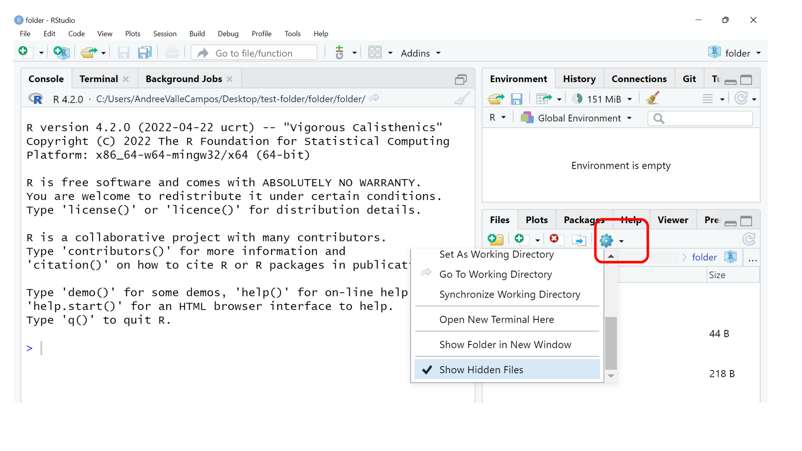

::::::::::::::::::::::::::::::::::::::: objectives

- Create a local Git repository.
- Describe the purpose of the `.git` directory.

::::::::::::::::::::::::::::::::::::::::::::::::::

:::::::::::::::::::::::::::::::::::::::: questions

- Where does Git store information?

::::::::::::::::::::::::::::::::::::::::::::::::::

## The `Git` jargon

`Git` is a topic that contains a lot of words to do version control.


We will locate them using this workflow bellow as template. We will relate Version control _actions_ that we can perform with specific _`git verb` commands_. These verbs will record your changes between `Git` _spaces_ associated to your folder.


In this episode, we are going to learn how to initialize Git to create a Local Repository in our folder, also known as Working directory or Workspace.

.

Let's start a new R project in Rstudio.

<!--

## Let's imagine this scenario

We will continue with the story of Wolfman and Dracula who are investigating if it
is possible to send a planetary lander to Mars.

{alt='motivatingexample'}
[Werewolf vs dracula](https://www.deviantart.com/b-maze/art/Werewolf-vs-Dracula-124893530)
by [b-maze](https://www.deviantart.com/b-maze) / [Deviant Art](https://www.deviantart.com/).
[Mars](https://en.wikipedia.org/wiki/File:OSIRIS_Mars_true_color.jpg) by European Space Agency /
[CC-BY-SA 3.0 IGO](https://creativecommons.org/licenses/by/3.0/deed.en).
[Pluto](https://commons.wikimedia.org/wiki/File:PIA19873-Pluto-NewHorizons-FlyingPastImage-20150714-transparent.png) /
Courtesy NASA/JPL-Caltech.
[Mummy](https://commons.wikimedia.org/wiki/File:Mummy_icon_-_Noun_Project_4070.svg)
© Gilad Fried / [The Noun Project](https://thenounproject.com/) /
[CC BY 3.0](https://creativecommons.org/licenses/by/3.0/deed.en).
[Moon](https://commons.wikimedia.org/wiki/File:Lune_ico.png)
© Luc Viatour / [https://lucnix.be](https://lucnix.be/) /
[CC BY-SA 3.0](https://creativecommons.org/licenses/by-sa/3.0/deed.en).

-->

## Create a local repository

Once Git is configured, we can start using it.

First, let's create a new R project.


Choose a `New directory` > `New project`. 


Write the Directory name for your R project (e.g. `folder`). If needed, browse where you want this R project to be.

WAIT! To initialize a local repository for your new R project, select the `Create a git repository` box. This step tells Git to make `folder` a [repository](../learners/reference.md#repository)
\-- a place where Git can store versions of our files


Now you have a local `git` repository. Look at the new file called `.gitignore` in the Files tab of the Output pane, usually in the Lower right corner. 


This step is known as `git init`.

.

It is important to note that `git init` will create a repository that
can include subdirectories and their files---there is no need to create
separate repositories nested within the `folder` repository, whether
subdirectories are present from the beginning or added later. Also, note
that the creation of the `folder` directory and its initialization as a
repository are completely separate processes.

::::::::::::::::: checklist

### Checklist


:::::::::::::::::::::::::::

## New files of a local repository

If we look at the Files tab to show the directory's contents, it appears that we only have one new file.

But under the "cogwheel" button we get access to the "More file commands". Click to the `Show hidden files` to show everything, we can see that Git has created a hidden directory within `folder` called `.git`:



The `.git` file gives the identity to the `.git` repository also known as the Local Repository “Local Repo”.


Git uses this special subdirectory to store all the information about the project,
including the tracked files and sub-directories located within the project's directory.
If we ever delete the `.git` subdirectory,
we will lose the project's history.

<!--
The status is not the same for Rstudio because it creates two files that are not created by default with git only. It is Rstudio the one that creates .gitignore and .Rproj files.

## Ask about the status your project.

We can check that everything is set up correctly
by asking Git to tell us the status of our project:

```bash
$ git status
```

```output
On branch main

No commits yet

nothing to commit (create/copy files and use "git add" to track)
```

If you are using a different version of `git`, the exact
wording of the output might be slightly different.
-->

:::::::::::::::::::::::::::::::::::::::  challenge

## Places to Create Git Repositories

Let's imaging that Wolfman and Dracula want to analyze planets data in a `git` initialized project called `planets`.

Along with tracking information about planets (the project we have already created),
Dracula would also like to track information about moons.
Despite Wolfman's concerns, Dracula creates a `moons` project inside his `planets`
project.

Using the terminal, Dracula did the following sequence of commands:

```bash
$ cd ~/Desktop   # return to Desktop directory
$ mkdir planets  # make a directory planets
$ cd planets     # go into planets directory, which is already a Git repository
$ git init       # make the planets directory a Git repository
$ ls -a          # ensure the .git subdirectory is present in the planets directory
$ mkdir moons    # make a subdirectory planets/moons
$ cd moons       # go into moons subdirectory
$ git init       # make the moons subdirectory a Git repository
$ ls -a          # ensure the .git subdirectory is present indicating we have created a new Git repository
```

THE QUESTION: Is the `git init` command, run inside the `moons` subdirectory, required for
tracking files stored in the `moons` subdirectory?

:::::::::::::::  solution

## Solution

No. Dracula does not need to make the `moons` subdirectory a Git repository
because the `planets` repository can track any files, sub-directories, and
subdirectory files under the `planets` directory.  Thus, in order to track
all information about moons, Dracula only needed to add the `moons` subdirectory
to the `planets` directory.

Additionally, Git repositories can interfere with each other if they are "nested":
the outer repository will try to version-control
the inner repository. Therefore, it's best to create each new Git
repository in a separate directory. To be sure that there is no conflicting
repository in the directory, check the output of `git status`. If it looks
like the following, you are good to go to create a new repository as shown
above:

```bash
$ git status
```

```output
fatal: Not a git repository (or any of the parent directories): .git
```

:::::::::::::::::::::::::

## Correcting `git init` Mistakes

Wolfman explains to Dracula how a nested repository is redundant and may cause confusion
down the road. Dracula would like to remove the nested repository. How can Dracula undo
his last `git init` in the `moons` subdirectory?

:::::::::::::::  solution

## Solution -- USE WITH CAUTION!

### Background

Removing files from a Git repository needs to be done with caution. But we have not learned
yet how to tell Git to track a particular file; we will learn this in the next episode. Files
that are not tracked by Git can easily be removed like any other "ordinary" files with

```bash
$ rm filename
```

Similarly a directory can be removed using `rm -r dirname` or `rm -rf dirname`.
If the files or folder being removed in this fashion are tracked by Git, then their removal
becomes another change that we will need to track, as we will see in the next episode.

### Solution

Git keeps all of its files in the `.git` directory.
To recover from this little mistake, Dracula can just remove the `.git`
folder in the moons subdirectory by running the following command from inside the `planets` directory:

```bash
$ rm -rf moons/.git
```

But be careful! Running this command in the wrong directory will remove
the entire Git history of a project you might want to keep.
Therefore, always check your current directory using the command `pwd`.


:::::::::::::::::::::::::

::::::::::::::::::::::::::::::::::::::::::::::::::

:::::::::::::::::::::::::::::::::::::::: keypoints

- `git init` initializes a repository.
- Git stores all of its repository data in the `.git` directory.

::::::::::::::::::::::::::::::::::::::::::::::::::


